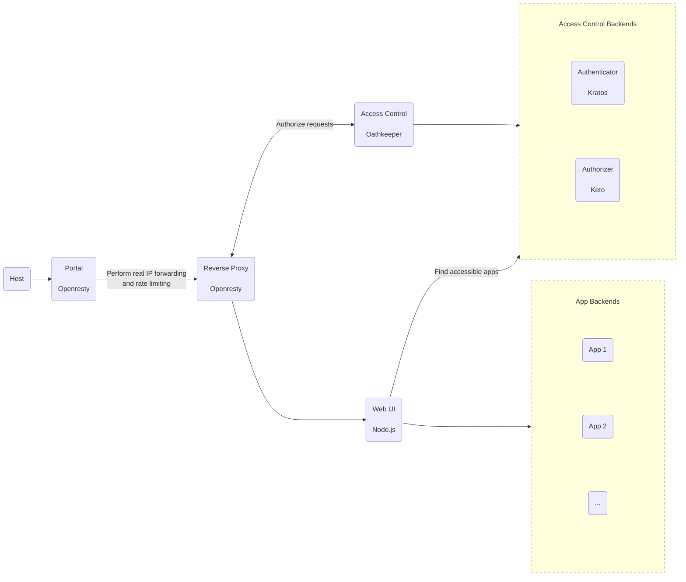

# Architecture

Lungo consists of three primary components:

- **Reverse proxy** - Openresty, responsible for authorizing incoming requests using Oathkeeper and forwarding them to
  the relevant backend.
- **Access control backends** - Kratos and Keto, which manage user authentication and authorization, respectively.
- **Application backends** - a set of applications accessible through the proxy.
